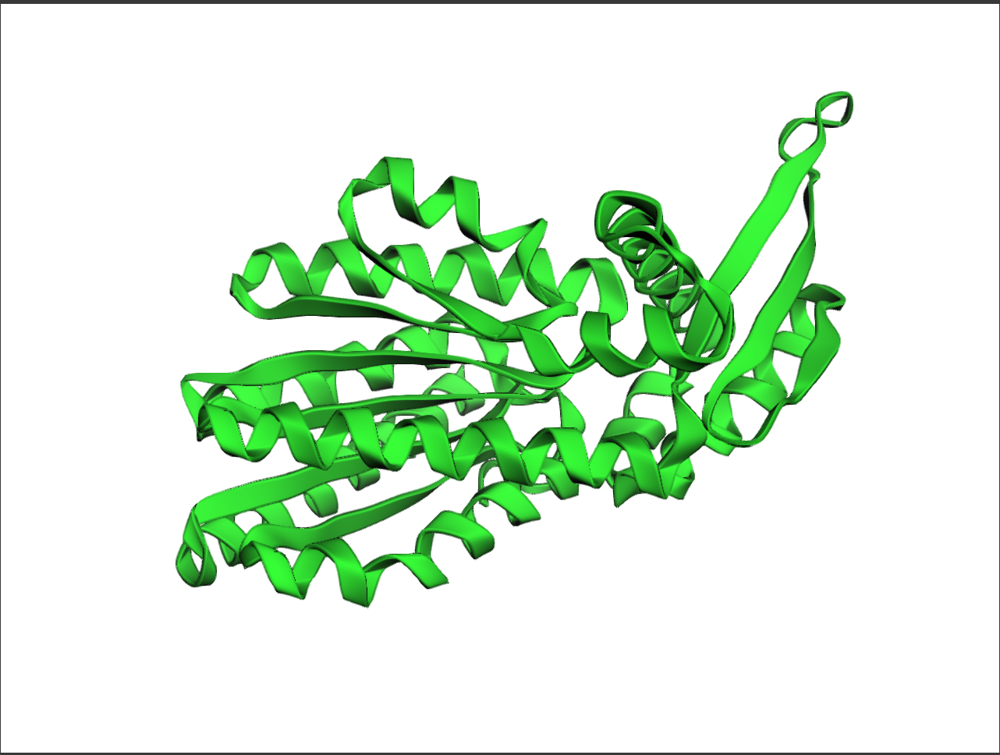
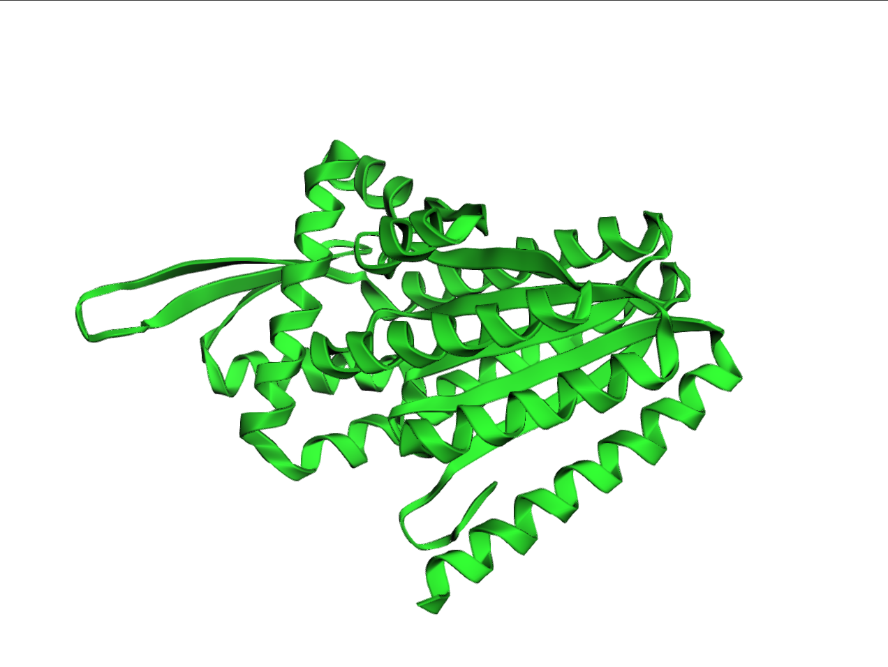
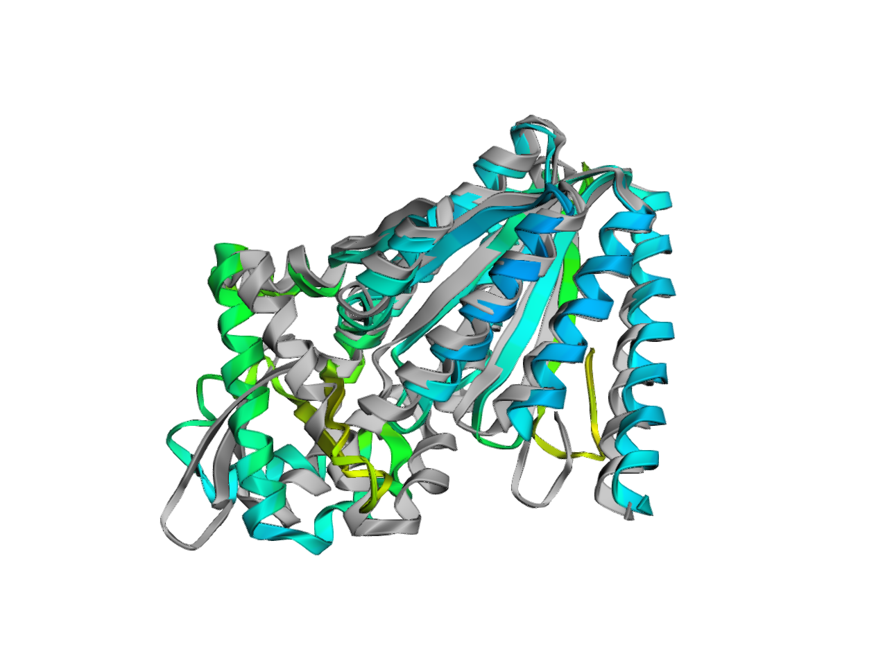
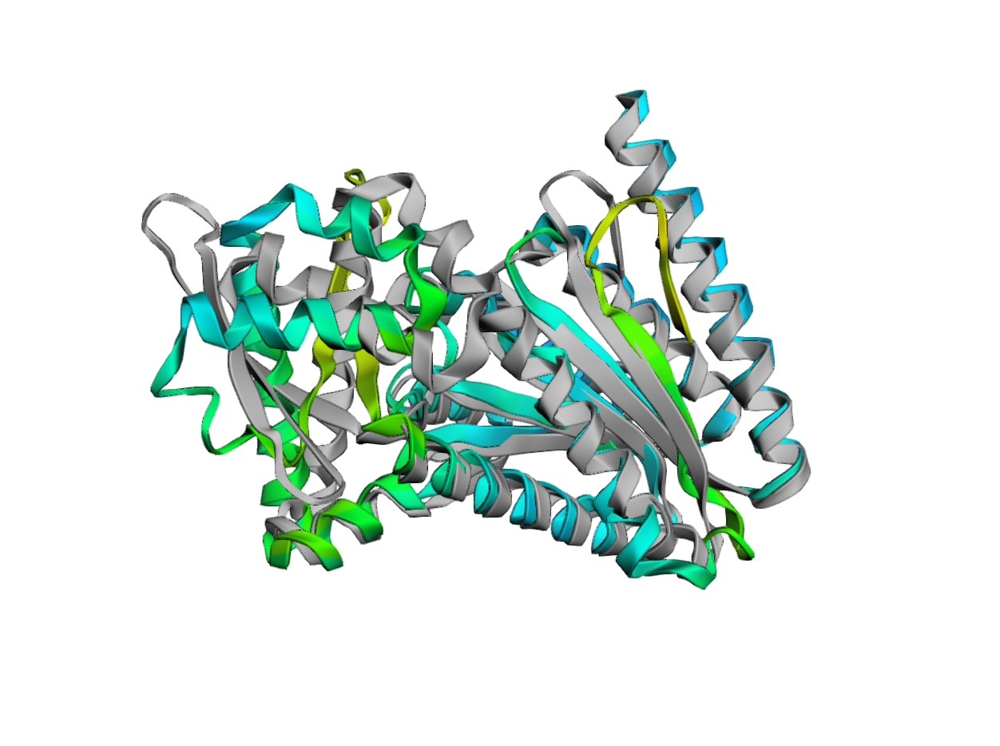

# Deep Learning Protein Mini Project
## Background
For this project, I implemented RFDiffusion to attempt to create a protein binding to EGFR. The protein database label for Epidermal Growth Factor Receptor is 6ARU. EGFR plays a major role in regulating cell growth and division as well as preventing apoptosis. Many types of cancers have overexpressed EGFR, which makes them proliferate in an uncontrolled manner. In designing an alternative binder to EGFR, the goal is to reduce the activity of this signaling pathway by providing an agent that could be used to deliver targeted treatment to cells where overexpression is occurring or outcompete existing natural ligands. 

## Methods
This protein backbone was created using RFDiffusion, a protein design network developed by members of the Baker Lab at the University of Washington. The network is a diffusion model that starts with a random jumble of amino acid backbone pieces that is iteratively organized into a coherent, viable protein backbone. The sequence to fit that backbone was then developed with the protein MPNN and was finally validated by AlphaFold. There were several parameters used to develop this specific protein. The specified length was 300 amino acids, and 6ARU was used for the target to bind to. Fifty training iterations were completed, no hotspots were specified, and only a single backbone structure was produced. The symmetry parameter was set to None, the order was left at 1, and the chains variable was given the value A. After the backbone was generated, MPNN was used to develop the sequence. The number of sequences was set to 8, MPNN sampling temp was 0.1, rm aa was set to C and the number of recycles was 1. All boolean variables were set to false. After the sequence was developed, its theoretical binding affinity was compared to other students' sequences using an MLM loss model.

## Results
One protein backbone and eight potential sequences to fill the backbone were generated. Below are images of the backbone and the predicted structure of the protein with the best amino acid sequence to fill the provided backbone. The first two images are the backbone structure from a few different angles and the second two are the best sequence fit from a few angles.

The selected sequence is  SEEEEERERALKEIIEETRRELKAAKAKHGKVVVVLIMASSTLEPEFILELSKALIKEMKSLFPNVVLIIVVVGLAPASLLARIRDVSLELAKYAKSLGIKVIVIVGNENEAVFVPAFEALGVEVIVDRTIIEIAAEELGLSEEEVLARFAAAAELLDELFAADPSLRERYARLDVAGATELLLERLRELFGAKVERHERLITVEVERVLTPDERRRVTAILLTPEAAREVVERLVDLVVDLILEKIAEGHNVLVLVFTPTIALAREVAALFEERRPLLEEAGAAVIIRLVARDPDTFLI. The output metrics of the prediction are mpnn:1.007, plddt:0.646, ptm:0.639, pae:14.112, rmsd:6.675. MPNN (Message Passing Neural Network Score) indicates confidence in the model's predicted protein structure. Values closer to 1 suggest a better alignment with expected structures, aiming for minimal deviation. pLDDT (Predicted Local Distance Difference Test) reflects the confidence of individual amino acids in the predicted structure again scores closer to 1 mean higher confidence. Predicted Template Modeling Score assesses the quality of the alignment between the predicted model and a template structure. The PAE and RSMD quantify slightly different aspects of the expected distance error between the predicted model and the actual structure, so the goal is for this value to be as small as possible. The selected sequence performed best in every category out of the other sequences developed by my iteration of MPNN. 

Compared to all of the generated proteins entered into the class spreadsheet, the MLM model predicts that the protein I created has the smallest loss value and, therefore, the highest binding affinity to EGFR. This protein received a loss value of 5.931364. The other outputs of proteins generated by my run of RF diffusion and MPNN are also provided in the outputs directory within this repository.

